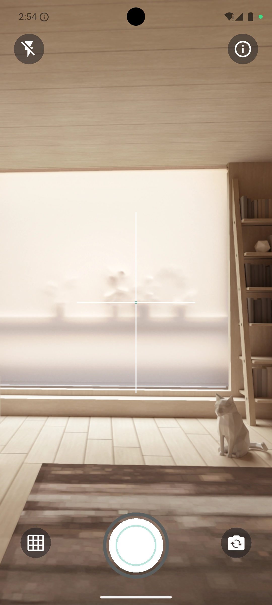
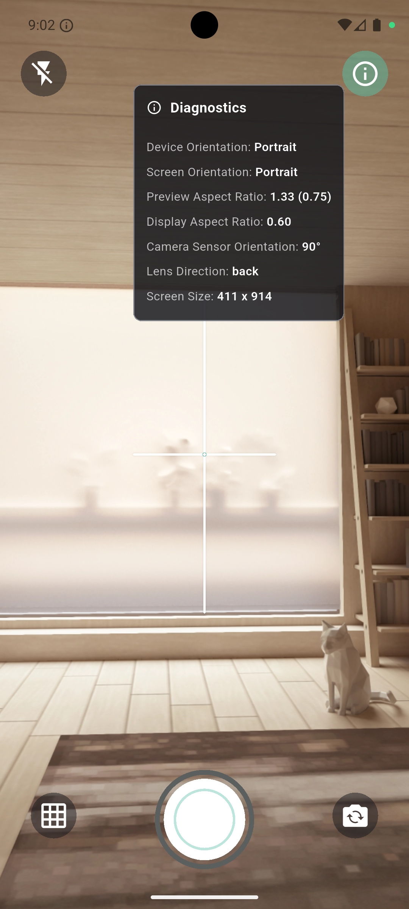
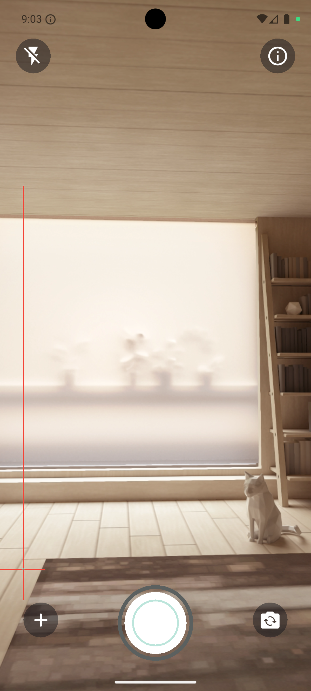
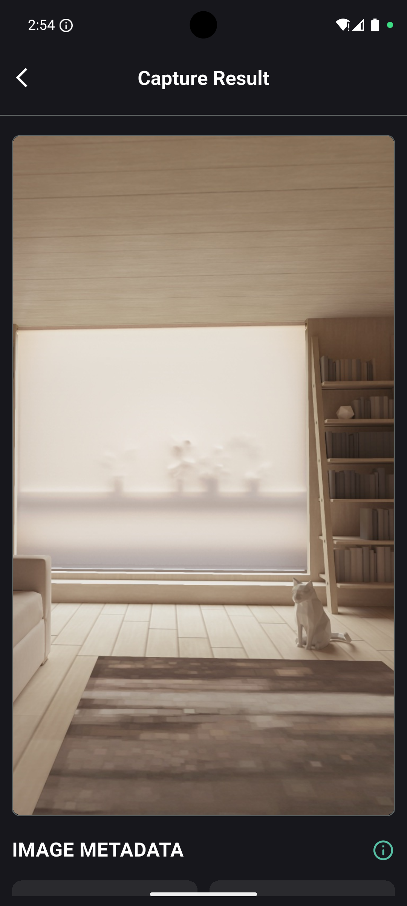
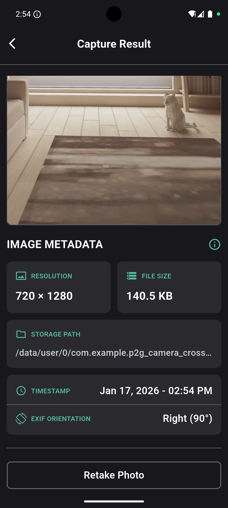
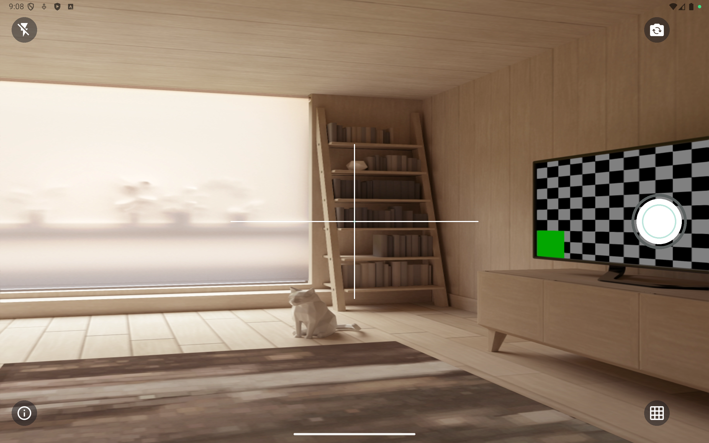
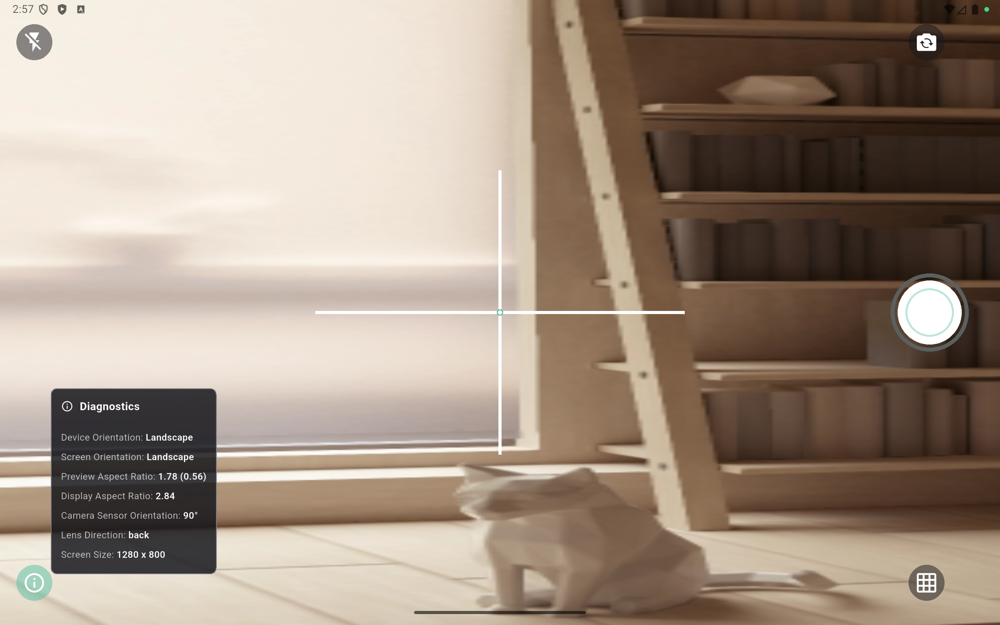
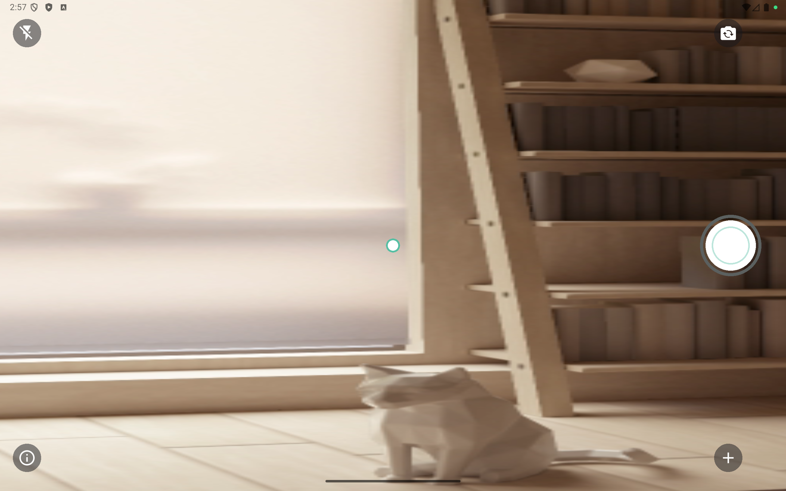
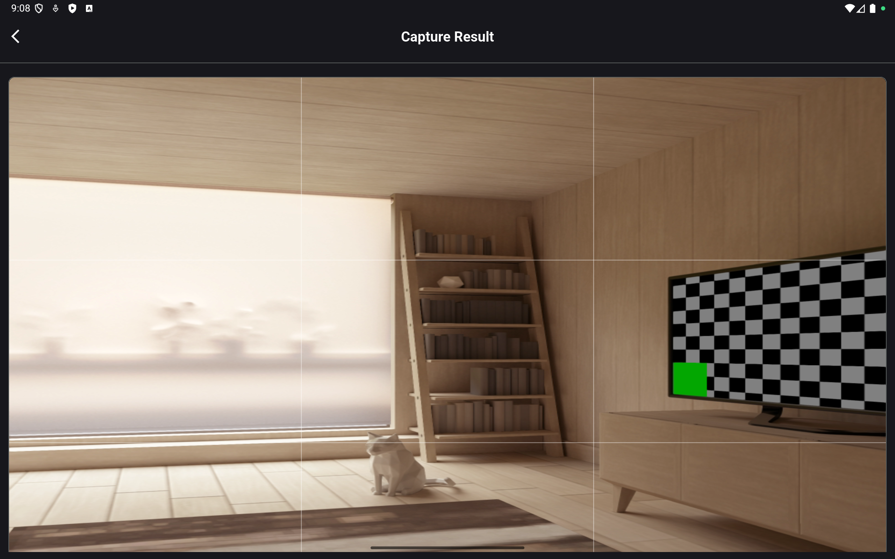
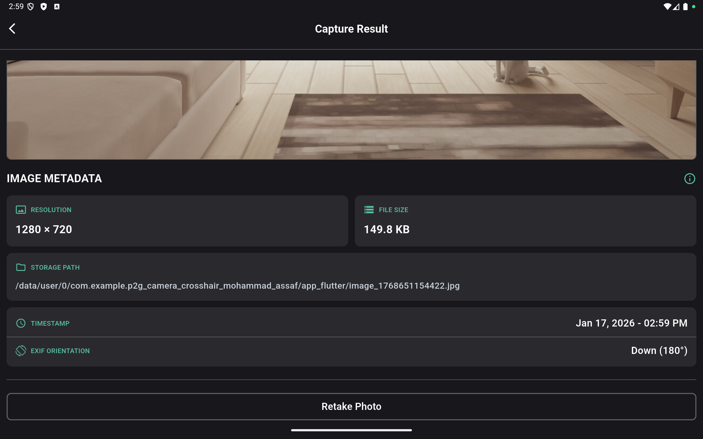

# P2G Camera Crosshair - Mohammad Assaf

A Flutter camera application featuring customizable grid overlays (crosshair, rule of thirds, aim dot) for precise photo composition and alignment.

## 📋 Table of Contents

- [Screenshots](#-screenshots)
- [Setup](#-setup)
- [Run Instructions](#-run-instructions)
- [Design Choices](#-design-choices)
- [Time Spent & Future Improvements](#️-time-spent--future-improvements)

---

## 📸 Screenshots

### Phone Views

<p align="center">
  
  
  
  
  
</p>

### Tablet Views

<p align="center">
  
  
  
</p>
<p align="center">
  
  
</p>

---

## 🔧 Setup

### Environment Requirements

- **Flutter SDK**: `>=3.38.5`
- **Dart SDK**: `^3.10.4`
- **Minimum iOS Version**: iOS 12.0+
- **Minimum Android Version**: API 21 (Android 5.0 Lollipop)

### Key Dependencies

```yaml
# Core Packages
flutter: sdk
camera: ^0.11.3              # Camera functionality
permission_handler: ^12.0.1  # Runtime permissions
native_exif: ^0.6.2          # EXIF metadata extraction
path_provider: ^2.1.5        # File system access

# State Management
bloc: ^9.2.0
flutter_bloc: ^9.1.1

# Code Generation
built_value: ^8.12.3
build_runner: ^2.10.5
built_value_generator: ^8.12.2

# Localization
intl: ^0.20.2
intl_utils: ^2.8.13
```

### Installation Steps

1. **Clone the repository**
   ```bash
   git clone https://github.com/MohammadAssaf10/p2g_camera_crosshair_mohammad_assaf
   cd p2g_camera_crosshair_mohammad_assaf
   ```

2. **Install dependencies**
   ```bash
   flutter pub get
   ```

3. **Generate code** (for built_value models and localization)
   ```bash
   make generate
   # Or manually:
   dart run build_runner build --delete-conflicting-outputs
   dart run intl_utils:generate
   ```

4. **iOS specific setup** (if running on iOS)
   ```bash
   cd ios
   pod install
   cd ..
   ```

---

## 🚀 Run Instructions

### Prerequisites

Ensure you have a physical device or emulator/simulator connected:
```bash
flutter devices
```

### Running the Application

#### Android
```bash
flutter run
# Or for release mode
flutter run --release
```

#### iOS
```bash
flutter run
# Or for a specific device
flutter run -d <device-id>
```

#### Using Make Commands

The project includes a Makefile for convenience:

- **Generate code**: `make generate`
- **Clean project**: `make cleanProject`
- **Reset project**: `make resetProject`
- **Generate localization**: `make intlGenerate`

### Platform-Specific Notes

#### iOS
- Camera permission is required. The app will request permission on first launch.
- Ensure `Info.plist` contains `NSCameraUsageDescription` (already configured).
- Physical device recommended for best camera performance.

#### Android
- Camera permission is handled via `permission_handler` package.
- `CAMERA` permission is declared in `AndroidManifest.xml` (already configured).
- Physical device recommended for best camera performance.

---

## 🎨 Design Choices

### 1. Camera Plugin Selection

**Choice**: `camera: ^0.11.3` (official Flutter plugin)

**Rationale**:
- **Official Support**: Maintained by the Flutter team with regular updates
- **Cross-platform**: Consistent API across iOS and Android
- **Feature Rich**: Supports flash control, camera switching, orientation handling
- **Well Documented**: Extensive documentation and community support
- **Performance**: Native implementation ensures smooth preview and capture

### 2. Grid Overlay Technique

**Implementation**: Custom widgets using Flutter's `Stack`

**Architecture**:
```
GridOverlayWidget (Selector)
    ├── Crosshair (Stack with positioned containers)
    ├── RuleOfThirdsGrid (CustomPaint with canvas drawing)
    └── AimDot (Centered circular widget)
```

**Technical Approach**:
- **Stack-based Layout**: Overlays positioned on top of camera preview
- **MediaQuery for Responsiveness**: Dynamic sizing based on screen dimensions
- **Orientation Awareness**: Grid adjusts automatically to portrait/landscape
- **BLoC State Management**: Grid mode selection handled via state

**Benefits**:
- **Zero Camera Stream Interference**: Overlays don't affect image capture
- **Hardware Acceleration**: Flutter's rendering pipeline optimized
- **Easy Customization**: Simple widget tree modifications
- **Clean Separation**: UI overlay completely decoupled from camera logic

### 3. Orientation Handling

**Strategy**: Dynamic responsive design with orientation detection

**Implementation**:
```dart
final Orientation orientation = MediaQuery.orientationOf(context);
// Adjust dimensions based on orientation
width: orientation == Orientation.portrait 
    ? screenSize.width * 0.35 
    : screenSize.width * 0.13
```

**Features**:
- **Automatic Adjustment**: Grid scales proportionally to orientation
- **Consistent Center Alignment**: Crosshair/grid remains centered
- **No Manual Rotation Logic**: Leverages Flutter's layout system
- **Aspect Ratio Preservation**: Camera preview maintains correct ratio

**Platform Handling**:
- iOS: Native orientation updates via `CameraController`
- Android: Automatic handling through Flutter framework

### 4. State Management

**Choice**: BLoC (Business Logic Component) pattern

**Rationale**:
- **Separation of Concerns**: Business logic isolated from UI
- **Testability**: Easy to unit test business logic
- **Predictable State**: Unidirectional data flow
- **Built Value Integration**: Immutable state with code generation

**State Structure**:
```dart
CameraState:
  - cameraController
  - gridMode (crosshair/ruleOfThirds/aimDot)
  - flashMode
  - cameraDirection
  - capturedImage
  - permissions status
```

### 5. Permission Handling

**Approach**: `permission_handler` with graceful degradation

**Flow**:
1. Check permission status on app launch
2. Request if not determined
3. Show custom permission denied UI if rejected
4. Provide settings navigation for permanently denied

**User Experience**:
- Clear messaging when permissions denied
- Non-intrusive permission requests
- Fallback UI instead of blank screen

### 6. Project Architecture

**Pattern**: Feature-based Clean Architecture

```
lib/
  ├── core/               # Shared utilities, routing, theming
  ├── features/
  │   ├── camera/        # Camera feature module
  │   │   └── presentation/  # UI & BLoC
  │   └── photo_details/ # Photo preview feature
  └── generated/         # Auto-generated code
```

**Benefits**:
- **Scalability**: Easy to add new features
- **Maintainability**: Clear separation of responsibilities
- **Reusability**: Core utilities shared across features
- **Testability**: Each layer independently testable

---

## ⏱️ Time Spent & Future Improvements

### Time Breakdown (5-6 Hours Total)

- **Project Setup & Structure** (30 min): Dependencies, architecture planning
- **Camera Integration** (1.5 hours): Camera plugin setup, permissions, preview
- **Grid Overlays** (30 min): Crosshair, rule of thirds, aim dot implementation
- **State Management** (1 hour): BLoC setup, state management logic
- **Orientation Handling** (30 min): Testing and adjusting for different orientations
- **Photo Details Feature** (45 min): EXIF data extraction, preview page
- **Testing & Debugging** (1 hour): Manual testing across orientations and permissions

### What I Would Do Next with More Time

1. **Comprehensive Testing Suite**
   - Expand unit test coverage to 80%+
   - Add widget tests for all custom components
   - Implement integration tests for critical flows

2. **Enhanced Grid Options**
   - Customizable grid colors and opacity
   - Persistent grid preference settings

3. **Advanced Camera Features**
   - Pinch-to-zoom functionality
   - Tap-to-focus and exposure control
   - Timer/countdown and burst mode

4. **User Experience Enhancements**
   - In-app photo gallery
   - Share functionality for captured photos

---

## 📄 License

This project is developed as a technical assessment.

## 👤 Author

**Mohammad Assaf**

---

## 🙏 Acknowledgments

- Flutter team for the camera plugin
- BLoC library maintainers
- Flutter community for excellent documentation
